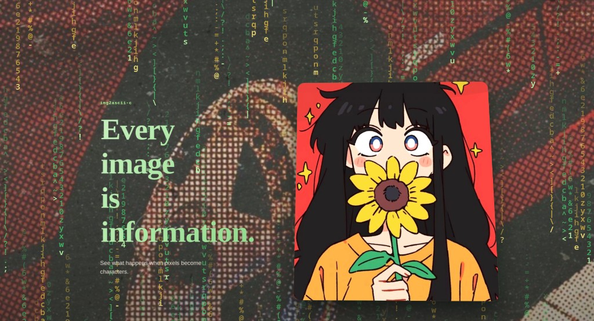
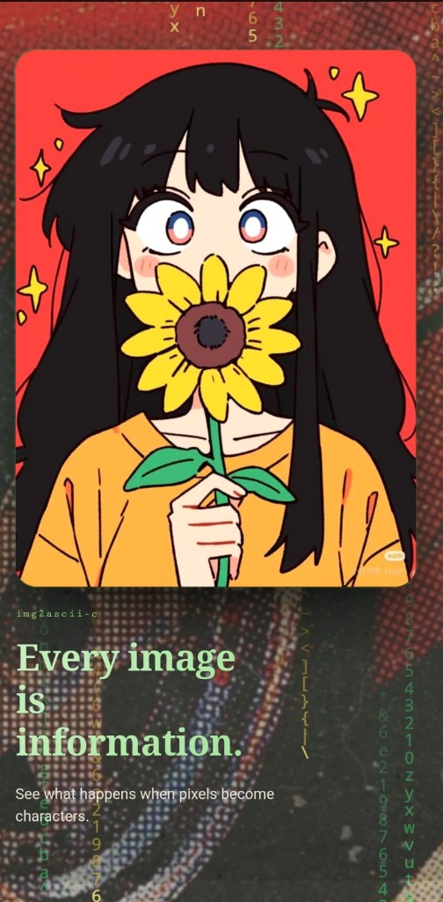
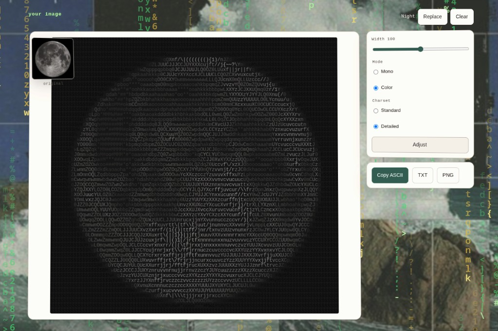
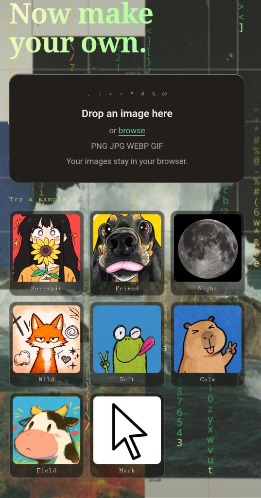

# LumaForm

**Live demo:** [lumaform-app.vercel.app](https://lumaform-app.vercel.app)

Turn any image into ASCII art as a **terminal CLI** (C) or a **browser app** (React). The web app runs entirely on your device: **your images stay in your browser.**

---

## What it does

Upload a photo and get ASCII that aims to preserve shapes, edges, brightness, and optionally color too. The conversion accounts for the fact that character cells are taller than they are wide, so circles don’t turn into ovals.

---

## Features

### Web (`web/`)

- Drag & drop, click upload, paste from clipboard
- Original vs ASCII comparison
- Monochrome or original-color ASCII (canvas-rendered)
- Width, brightness, contrast, character set
- Edge enhancement (Sobel blend): Off / Low / Medium / High
- Floyd–Steinberg dithering
- Invert mapping
- Copy ASCII, download TXT, download PNG
- Light / dark via `prefers-color-scheme`
- No accounts, no backend, no image uploads

### C CLI (`c-engine/`)

- Brightness / edges / hybrid modes
- ANSI 24-bit color (or `--no-color`)
- Border & fill styles
- Save to `.txt` with `--output`
- stb_image loading (PNG, JPEG, …)

---

## Live demo

**Live Demo:** [https://lumaform-app.vercel.app](https://lumaform-app.vercel.app)

### Screenshots

**Laptop**



**Phone**



**Converter**



**Samples**



---

## Project structure

```
LumaForm/
├── c-engine/          # C terminal CLI (buildable on its own)
│   ├── src/
│   ├── include/
│   └── Makefile
├── web/               # Vite + React browser app
│   ├── src/
│   │   ├── components/
│   │   └── lib/       # image → ASCII pipeline
│   └── package.json
├── assets/            # sample.jpg, moon.png
├── docs/
│   ├── architecture.md
│   └── border-fill-styles.md
├── Makefile           # forwards to c-engine/
└── vercel.json
```

---

## How to run locally

### Web application

```bash
cd web
npm install
npm run dev
```

Open the URL Vite prints (usually `http://localhost:5173`).

Try the built-in samples (`sample.jpg`, `moon.png`) or drop your own image.

```bash
npm run build    # production build → web/dist
npm run preview  # preview production build
npm test         # small unit checks (mapping, tone, dither)
```

### C CLI

Requirements: GCC (C99), Make, `libm`.

```bash
make             # or: make -C c-engine
./c-engine/build/lumaform assets/sample.jpg
./c-engine/build/lumaform -w 100 --mode hybrid assets/moon.png
./c-engine/build/lumaform --no-color --output out.txt assets/sample.jpg
```

Windows: use `c-engine/build.bat`.

---

## Image processing pipeline

```
INPUT IMAGE
  → decode
  → resize (preserve aspect) + character-aspect correction
  → luminance (BT.709)
  → brightness / contrast
  → optional Sobel edge blend
  → optional Floyd–Steinberg dither
  → character selection (± invert)
  → optional color from source pixels
  → render (terminal ANSI or browser canvas)
```

Details: [docs/architecture.md](docs/architecture.md).

### Character mapping

- **Standard:** ` .:-=+*#%@`
- **Detailed:** longer set for smoother tones

Ordered light → dense. Default: dark pixels → dense characters. **Invert** flips this.

### Aspect ratio correction

Without correction, ASCII looks vertically stretched. Height is scaled by a character aspect factor:

- Web: `8/14` (matches the canvas glyph cell)
- CLI: `0.45` (typical terminal fonts)

### Edge detection

Sobel 3×3 kernels → gradient magnitude. Web blends edges into luminance at Low / Medium / High weights. Off by default path uses Low for a bit of structure without noise.

### Dithering

Optional Floyd–Steinberg error diffusion improves perceived tonal steps on the discrete character ramp.

---

## Privacy

The web app processes images with the Canvas API in your browser. Nothing is sent to a server for conversion. (Loading the page itself still uses normal static hosting.)

---

## Performance notes

- Work is done at the chosen ASCII resolution (not full image size for character mapping).
- Width defaults to 100; max 220 to keep the UI responsive.
- Sliders are debounced; rendering uses one canvas, not one DOM node per character.
- Very large files (>25 MB or extreme pixel counts) are rejected with a clear message.

---

## Limitations

- TXT download is plain characters (no color). Use PNG for colored ASCII.
- GIF support is “first frame / browser-decoded,” not animation.
- EXIF orientation depends on the browser’s image decoder.
- ASCII cannot match photographic detail; fidelity is perceptual, not pixel-perfect.
- The C CLI and web app are sibling implementations — outputs will be similar but not identical.

---

## Future improvements

- More character sets / custom charset
- Side-by-side compare slider
- Screenshot / GIF assets in `docs/screenshots/`

---

## Credits

- [stb_image](https://github.com/nothings/stb) by Sean Barrett — C image loading
- Inspired by [ascii-view](https://github.com/gouwsxander/ascii-view)

## License

MIT — see [LICENSE](LICENSE).
